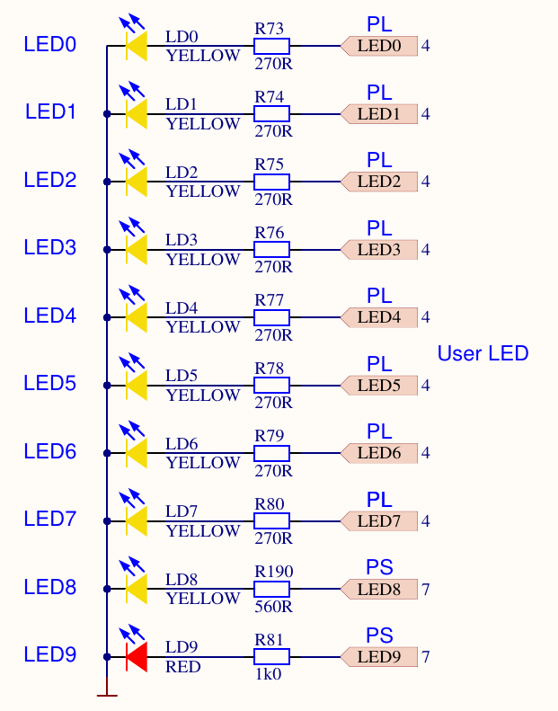
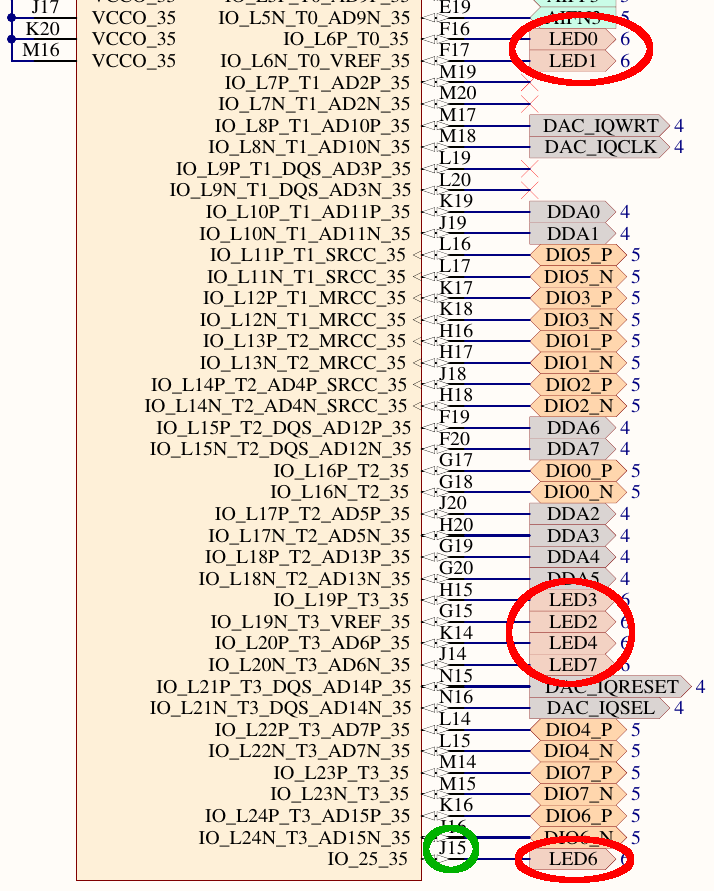
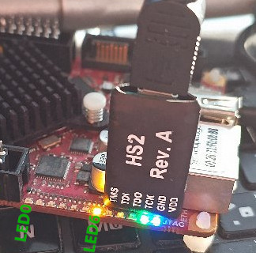

Supporting material for J.-M Friedt, "D&eacute;bugger un syst&egrave;me embarqu&eacute; avec GDB et JTAG : mauvais &eacute;l&egrave;ves,
boundary scan et syst&egrave;mes asym&eacute;triques", Hackable 64 (Jan-Feb 2026) [in French].

The engineering schematic of the Red Pitaya board provides the link between the pin of the Zynq7010 and the LED visible on the board



The <a href="XC7Z010_CLG400.bsdl">BSDL</a> file describing the cells in the Zynq 7010 was downloaded
from https://bsdl.info/.

The OpenOCD scripts <a href="redpitaya1.openocd">redpitaya1.openocd</a> and <a href="redpitaya2.openocd">redpitaya2.openocd</a> demonstrate how to generate boundary scan commands, first for probing the JTAG
chain and identifying the ARM processors and the FPGA, and then manipulating the GPIO pins
connected to the LEDs. These scripts are executed with the ``-f`` argument of OpenOCD, assuming a Digilent
HS2 JTAG probe is used:
```
sudo openocd -f redpitaya1.openocd
```


Demonstration of boundary scan commands sent through the JTAG interface for switching on and off the LEDs:


